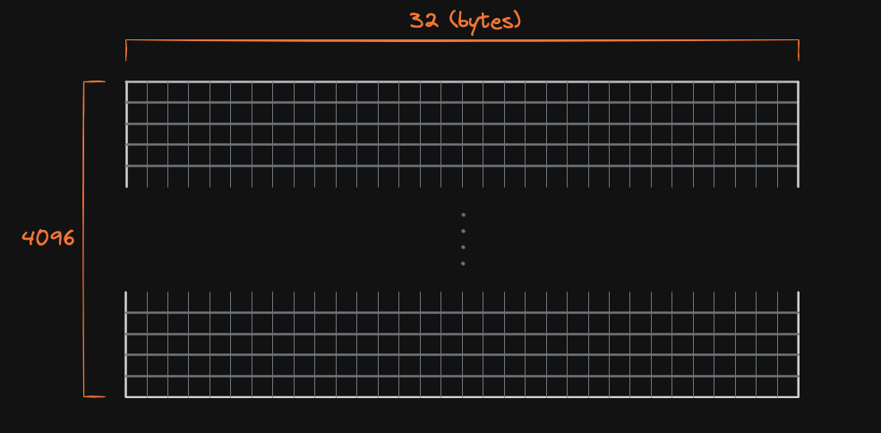

# Blob Carrying Transactions

## Intro
이더리움은 현재 4가지 type의 transaction이 정의되어 있다. 그리고 transaction을 전달받는 블록체인 노드(네트워크)가 이를 구분하기 위해 이더리움은 EIP-2718를 도입하여 transaction 별로 type을 지정했다. type은 RLP 인코딩 단계에서 가장 앞단에 배치되며, 네트워크는 디코딩 단계에서 이를 통해 transaction을 구분할 수 있게 됬다. 그리고 이더리움의 덴쿤 업그레이드(2024-3-13)에서 EIP-4844가 
도입되며, type `0x03`을 지정받은 **Blob Carrying Transactions**이 새로 등장한다.

 

## What is Blob?
Blob Carrying Transactions은 Blob을 작성할 수 있는 새로운 필드(field)가 포함된 트랜잭션 형식(format)을 갖추고 있다.여기서 **`Blob`** 이란 **“다수의 데이터가 압축된 데이터” 를 저장하기 위해 암호학적으로 설계된 “저장 공간”** 이다. 그리고 이더리움은 **KZG Polynomial Commitments Scheme(이하 KZG)** 을 활용하여 Blob에 저장된 “다수의 데이터가 압축된 데이터”에 “특정 데이터”가 포함되었는지 검증 할 수 있다. 이더리움은 Blob을 롤업 체인들이 제공하는 데이터를 효율적으로 저장하기 위해 새롭게 만든 “저장 공간”이다. 하지만, 롤업 데이터 외에도 데이터를 압축하고 증명이 필요한 경우 언제든지 활용할 수 있다.

 

     

Blob은 하나당 32 bytes의 용량를 갖는 4096개의 필드로 구성되어 있다. 즉, 1 Blob에 최대 131,072 bytes (4096 &times 32 bytes  ≈ 128kB)의 용량(blobSize)를 수용할 수 있게 설계됬다.